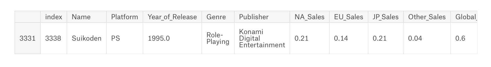
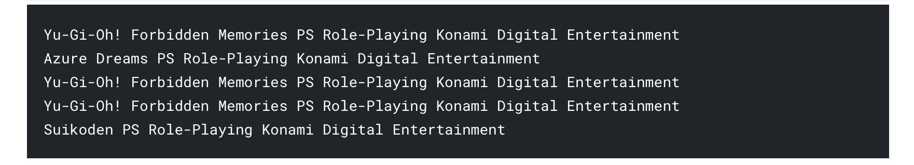

# GAME RECOMMENDATION BY MULTIPLE FEATURES (GENRE, PLATFORM, PUBLISHER)

#

A simple recommendation system using cosine similarity based on genre, platform, and publisher resemblance

For instance:
- your favourite game = __*Suikoden*__

- Genre = __*Role-Playing*__
- Platform = __*PS*__
- Publisher = __*Konami Digital Entertainment*__

Then it will gives top 5 game recommendation which has > 80% similarity with Suikoden

Cheers! :beers: :beers:

#
#### About Me: Suryo Tri Atmojo 👨‍🔬👨‍💻
#### Reach me out 📬 : _atmojo.suryo@gmail.com_

[GitHub](https://github.com/suryotriatmojo)
|
[Instagram](https://www.instagram.com/suryotriatmojo/)
|
[Facebook](https://www.facebook.com/suryo.t.atmojo)
|
[LinkedIn](https://www.linkedin.com/in/suryo-tri-atmojo-3ab69a85/)
|
[Twitter](https://twitter.com/suryota)